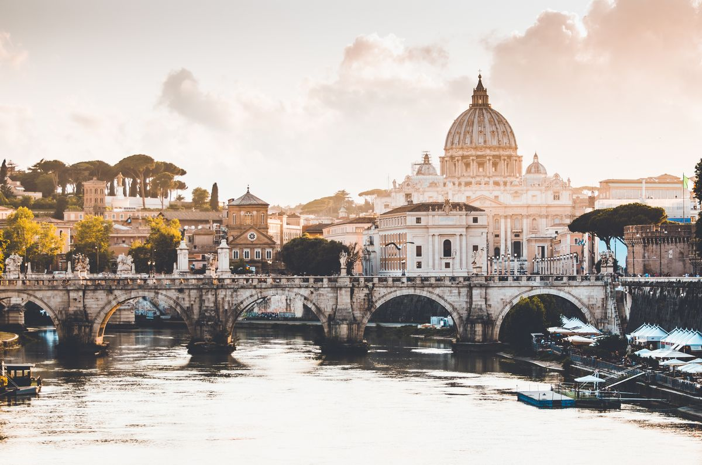

## Dreaming of Rome

Do you know this feeling when you see so many beautiful places around you that you start feeling dizzy and there a need of at least a couple of hours to process the information? Well, I do. This happened to me in the city to where all the roads lead. 

## Making dreams come true

When I arrived to Rome just for a day and I felt like the city resembels the exhibition halls of a huge museum without a roof: a living collage of squares, open-air markets and historical places, the view of which will remain in your memory for a long time. My first stop was Trevi Fountain, where I threw 3 coins for coming back to Rome, meeting my love in Rome and lastly to get married in Rome. I know it's silly, but I believe in fairytales.

During the next hours I've been marveling at the greatness of the Colosseum and the Pantheon. Afterwards, I refilled the energy with the cappuccino to spend the another hours in the various churches. Each one of them impressed me even move than the previous. Rome is truly magical city. 

So my question is, have you been to Rome? If not, book your ticket NOW!
